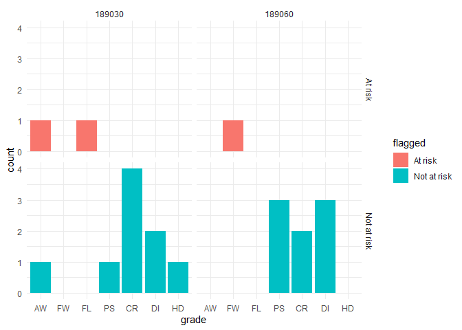
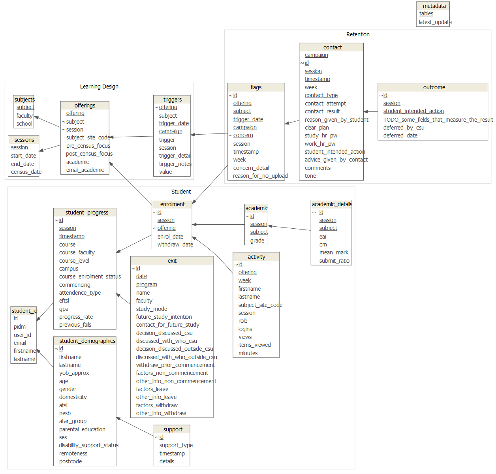

<!-- README.md is generated from README.Rmd. Please edit that file -->

# retention.helpers

<!-- badges: start -->
<!-- badges: end -->

The goal of retention.helpers is to provide a few functions to help
working with the CSU Retention Team’s data set, within the R
environment.

## Installation

You can install the development version from
[GitHub](https://github.com/) with:

``` r
# install.packages("devtools")
devtools::install_github("benwhicks/retention.helpers")
```

You should also have the tidyverse installed and loaded to get the most
out of the package:

``` r
# install.packages("tidyverse")
library(tidyverse)
```

The best way to interface with the data is through the `retention.data`
package. This package is not shared publicly, so you will need to obtain
a copy of the R Package itself and build the package yourself. This is
done in RStudio using `Ctrl-Shift-B` or by going to the *Build* pane
(usually in the top right along with *Environment*) and selecting
*Install and Restart*.

## Examples

### Loading Data

This package is designed to work *with* the retention data set. This can
be loaded two ways:

You can load from a folder containing the .rda files directly:

``` r
# ============================================= #
# Loading via a folder of the .rda files
# ============================================= #
library(tidyverse)
folder_of_rda_files <- file.path('~', 'path', 'to', 'folder') # Change this to where you have them stored
rda_files <- list.files(folder_of_rda_files, 
                        pattern = ".rda", 
                        full.names = TRUE) # This grabs only rda files in folder_of_rda_files
# Loading the data into your environment
rda_files %>% 
  map(load)
```

Or you can load from the `retention.data` package:

``` r
# ============================================= #
# Loading data via the retention.data package
# ============================================= #
library(retention.data)
```

The benefit of using the package version of the data is that it comes
with in built documentation, using R’s usual help syntax, `?`.

``` r
?student_progress
```

### Wrangling

This package has a handful of functions for common data
wrangling-munging-tidying tasks using the retention data. Most involve
adding a derived variable from an existing data frame. For example if
`offering` is in the data frame (which comes in the form
`ABC123_201990_W_D`) then we can extract the subject `ABC123`, session
`201990` or year `2019`.

### Adding variables

``` r
# creating a data frame with offerings
library(retention.helpers)
offs <- tibble(offering = c("MTH120_189030_P_D", "PHL100_189030_P_D"))
offs
#> # A tibble: 2 x 1
#>   offering         
#>   <chr>            
#> 1 MTH120_189030_P_D
#> 2 PHL100_189030_P_D

# adding the subject and year
offs %>% 
  add_subject_from_offering() %>% 
  add_year_from_offering()
#> # A tibble: 2 x 3
#>   offering          subject  year
#>   <chr>             <chr>   <dbl>
#> 1 MTH120_189030_P_D MTH120   1890
#> 2 PHL100_189030_P_D PHL100   1890
```

### Joining

``` r
# Joining demographics and academic
student_demographics %>% 
  inner_join(academic, by = "id") %>% 
  head()
#> # A tibble: 6 x 10
#>   id    firstname lastname yob_approx gender domesticity ses   session subject
#>   <chr> <chr>     <chr>         <dbl> <chr>  <chr>       <fct>   <dbl> <chr>  
#> 1 1     Evariste  Galois         1811 Male   Domestic    Low ~  189030 MTH100 
#> 2 1     Evariste  Galois         1811 Male   Domestic    Low ~  189030 MTH110 
#> 3 1     Evariste  Galois         1811 Male   Domestic    Low ~  189030 MTH120 
#> 4 1     Evariste  Galois         1811 Male   Domestic    Low ~  189030 PHL100 
#> 5 2A    Emmy      Noether        1882 Female Domestic    Med ~  189030 MTH100 
#> 6 2A    Emmy      Noether        1882 Female Domestic    Med ~  189030 MTH110 
#> # ... with 1 more variable: grade <fct>

# Joining progress and academic and flags
flags %>% 
  inner_join(academic, by = c("id", "subject", "session"))
#> # A tibble: 3 x 8
#>   id    subject session offering          campaign    week concern        grade
#>   <chr> <chr>     <dbl> <chr>             <chr>      <dbl> <chr>          <fct>
#> 1 1     MTH120   189030 MTH120_189030_P_D pre census     3 low activity   FL   
#> 2 1     PHL100   189030 PHL100_189030_P_D pre census     3 non submission AW   
#> 3 2A    MTH302   189060 MTH302_189060_B_I pre census     3 non submission FW
```

### Visualising

``` r
# Trying to visualise grade distributions of flagged vs non flagged
academic %>% 
  left_join(
    flags %>% 
      filter(campaign == "pre census") %>% # only looking at pre census flags
      select(id, subject, session) %>% # only selecting what is required for joining with academic
      mutate(flagged = "At risk"), # left join as we want all academic, which creates NA's if no match
    by = c("id", "subject", "session")) %>%  
  mutate(flagged = replace_na(flagged, "Not at risk")) %>% # NA's did not appear in the flag table
  ggplot(aes(grade)) +
  stat_count(aes(fill = flagged)) +
  facet_grid(flagged ~ session) +
  theme_minimal() 
```



## Data Model

This is the **intended** end product, but not all tables are complete or
tidy yet.


